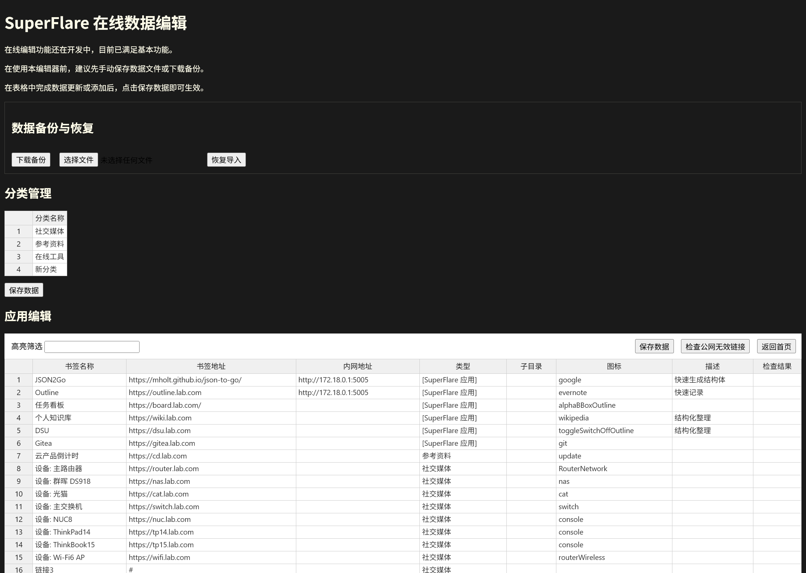
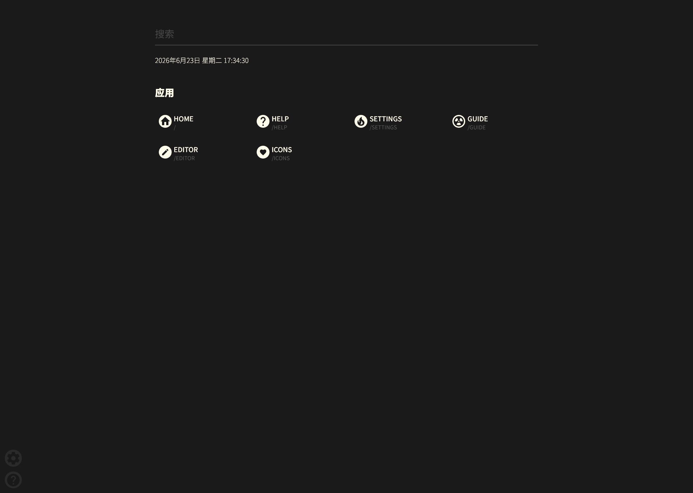

# SuperFlare

SuperFlare 是一个从 [soulteary/docker-flare](https://github.com/soulteary/docker-flare) 分叉并持续重构的个人导航页项目。

当前仓库只以现有代码、现有页面和现有配置模型为准，不再把兼容历史材料本身当成目标。项目主线围绕原生运行、后续 `fnOS` / 飞牛 NAS 应用封装，以及更适合长期自维护的首页体验继续演进。

## 项目定位

- 上游来源：`soulteary/docker-flare`
- 当前代码基线：本仓库 `main` 分支
- 默认运行方式：原生二进制
- 后续封装方向：`fnOS` / 飞牛 NAS 应用
- Docker：仅保留兼容说明，不再作为推荐部署方案

## 当前分支的亮点

SuperFlare 保留了上游轻量、无数据库、配置透明的基本思路，同时针对本地和 NAS 场景补上了这些能力：

- 更完整的设置页与编辑页联动
- 登录账号密码支持写入配置文件
- 登录令牌有效期延长为 90 天
- 编辑页支持数据备份、恢复导入、公网无效链接主动检查
- 新增端口设置页，支持备注持久化与编辑器内网地址快捷选择
- 首页与重定向页支持更完整的中英文切换
- 首页支持自定义背景图、背景玻璃效果、背景强度与布局宽度/列数控制
- 支持自定义网站图标、网站标题、首页模块标题、书签分类/书签文字颜色
- 书签和分类支持子目录折叠
- 手机窄布局使用瀑布流，宽布局保持网格对齐
- 首页时间实时更新，并配套 CSP nonce 处理
- 书签未设置图标时自动回退抓取站点 favicon

## 当前界面快照

以下截图均来自当前仓库代码运行结果。

### 设置页


### 编辑页



### 免登录帮助页



## 当前仓库内容

```text
build/              构建脚本与资源生成
cmd/                启动参数与环境变量
config/             配置模型与默认配置
docker/             兼容构建脚本，仅供参考
docs/               当前项目文档
embed/              模板与静态资源源文件
fnApp/              预留给 fnOS / 飞牛应用打包层
internal/           主要业务代码
metrics-reports/    性能基线资料
screenshots/        当前版本截图
scripts/            辅助脚本
tools/              工具程序
```

## 本地开发

运行前需要准备 Go `1.26.x`。

```bash
go run build/build.go
go run .
```

默认从当前工作目录读取：

- `config.yml`
- `apps.yml`
- `bookmarks.yml`
- `ports.yaml`

这些文件和 `var/` 目录都属于本地运行数据，不纳入 Git。

## 常用命令

```bash
go run build/build.go
go test ./... -count=1
go build ./...
```

## 文档

- [功能概览](./docs/overview.md)
- [当前配置说明](./docs/config-reference.md)
- [Material Design Icons 使用](./docs/material-design-icons.md)
- [Docker 兼容说明](./docs/compat-docker.md)
- [基线性能采集](./docs/baseline-metrics.md)
- [当前分支变更记录](./CHANGELOG.md)

## 仓库

- GitHub: [junfuchang/superflare](https://github.com/junfuchang/superflare)
